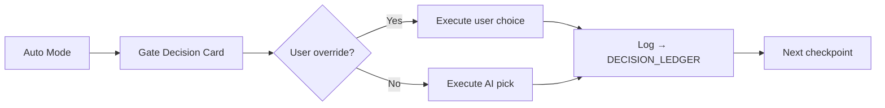

# Charts & Diagrams

> Rendered using GitHub’s built‑in Mermaid support.

## 1) Phase Map (V50, linear view)

```mermaid
flowchart TD
  I1["I‑1 Autonomous Spark Generation"] --> I0["I‑0 Initialization & Data Rights"]
  I0 --> A0["Pre‑Exec: TRIZ/ARIZ (-0.8) → C‑0.8"]
  A0 --> A1["Pre‑Exec: C‑K Drift (-0.5A) → C‑0.5A"]
  A1 --> A2["Pre‑Exec: Worth‑It Sprint (-1) → C‑0.5"]
  A2 --> B0["0 Opportunity & Mode / Runner Handshake → C0.1"]
  B0 --> B1["1 Context & Precedents → C1.1"]
  B1 --> B2["2 Influence Harvesting → C2.1"]
  B2 --> B25["2.5 Futures & Morph Space → C2.5"]
  B25 --> B3["3 Constraints & Envelope → C3.1"]
  B3 --> B4["4 Hypotheses & Branch Tree → C4.1"]
  B4 --> B4A["4.A Red‑Team Attack → C4.A"]
  B4A --> B5["5 Conceptual Modeling & Architecture → C5.1"]
  B5 --> B6["6 Simulation & Functional Modeling → C6.1"]
  B6 --> B65["6.5 Multi‑Agent War Game → C6.5"]
  B65 --> B7["7 Iterative Refinement → C7.1"]
  B7 --> B9["9 Validation & Benchmarking → C7 / C7.Sigma / C7.Repro"]
  B9 --> B10["10 Simplicity (C8.4) → Optimization (C8.5)"]
  B10 --> B11["11 Productization + 11.3 IP & Disclosure → C6.9"]
  B11 --> B12["12 Documentation & Handoff → C12.1"]
  B12 --> B135["13.5 Devastation Protocol → C13.5"]
  B135 --> B13["13 Deployment Readiness & Safety Case → C9"]
  B13 --> B14["14 Continuous Evaluation → C14.1"]
  B14 --> B145["14.5 Continuous Adversary Shadowing → C14.5"]
  B145 --> B15["15 Archival / Export / Postmortem → C15.1"]
```

---

---

**Fields (short)**

- **Options:** Proceed / Branch / Return / End
- **Rec:** AI pick + reason
- **Conf:** 0–1 or Low/Med/High
- **Cost/Time:** S / M / L
- **Risk:** key downside

t="1536" alt="ChatGPT Image Aug 25, 2025, 01_14_48 PM" src="https://github.com/user-attachments/assets/5e8d3c00-2ed0-447a-8626-462e56fc1201" />

 25, 2025, 01_16_36 PM" src="https://github.com/user-attachments/assets/6f1b0cc7-7358-4598-ae4a-6bc0df5406e3" />

