# Charts & Diagrams

> Rendered using GitHub’s built-in Mermaid support. :contentReference[oaicite:1]{index=1}

## 1) Phase Map (V49, linear view)

```mermaid
flowchart TD
  A0["Pre-Exec: TRIZ/ARIZ (-0.8) → C-0.8"] --> A1["Pre-Exec: C-K Drift (-0.5A) → C-0.5A"]
  A1 --> A2["Pre-Exec: Worth-It Sprint (-1) → C-0.5"]
  A2 --> B0["0 Opportunity & Mode / Runner Handshake → C0.1"]
  B0 --> B1["1 Context & Precedents → C1.1"]
  B1 --> B2["2 Influence Harvesting → C2.1"]
  B2 --> B25["2.5 Futures & Morph Space → C2.5"]
  B25 --> B3["3 Constraints & Envelope → C3.1"]
  B3 --> B4["4 Hypotheses & Branch Tree → C4.1"]
  B4 --> B4A["4.A Red-Team Attack → C4.A"]
  B4A --> B5["5 Conceptual Modeling & Architecture → C5.1"]
  B5 --> B6["6 Simulation & Functional Modeling → C6.1"]
  B6 --> B65["6.5 Multi-Agent War Game → C6.5"]
  B65 --> B7["7 Iterative Refinement → C7.1"]
  B7 --> B9["9 Validation & Benchmarking → C7 / C7.Sigma / C7.Repro"]
  B9 --> B10["10 Simplicity (C8.4) → Optimization (C8.5)"]
  B10 --> B11["11 Productization + 11.3 IP & Disclosure → C6.9"]
  B11 --> B12["12 Documentation & Handoff → C12.1"]
  B12 --> B135["13.5 Devastation Protocol → C13.5"]
  B135 --> B13["13 Deployment Readiness & Safety Case → C9"]
  B13 --> B14["14 Continuous Evaluation → C14.1"]
  B14 --> B145["14.5 Continuous Adversary Shadowing → C14.5"]
  B145 --> B15["15 Archival / Export / Postmortem → C15.1"]
```



Checkpoints quick index
Code	Name
C-0.8	TRIZ/ARIZ
C-0.5A	C-K drift check
C-0.5	Worth-It decision
C0.1	Opportunity & Mode / Runner
C1.1	Context & Precedents
C2.1	Influence harvesting
C2.5	Futures & Morph space
C3.1	Constraints & Envelope
C4.1	Hypotheses & Branch tree
C4.A	Red-Team attack
C5.1	Conceptual modeling & architecture
C6.1	Simulation & functional modeling
C6.5	Multi-Agent War Game
C7	Validation (core)
C7.Sigma	Statistical sufficiency
C7.Repro	Reproducibility gate
C8.4	Simplicity
C8.5	Optimization
C6.9	Productization packaging
C12.1	Documentation & Handoff
C13.5	Devastation protocol
C9	Deployment readiness & safety case
C14.1	Continuous Evaluation
C14.5	Continuous Adversary Shadowing
C15.1	Archival / Export / Postmortem

2) Universal Gate Decision Card (Auto-Mode UX)
```mermaid
Copy
Edit
flowchart TD
  S0["Auto Mode ON"] --> S1["Print Gate Decision Card"]
  S1 --> Q{"User override?"}
  Q -- "Yes" --> U1["Execute user choice"]
  Q -- "No"  --> A1["Execute AI recommendation"]
  U1 --> L1["Log to DECISION_LEDGER"] --> N1["Next checkpoint"]
  A1 --> L1
Gate Decision Card fields
```

```markdown
Field	Meaning
Options	Proceed / Branch Phase N / Return C#.# / End & export
Descriptions	1-line summaries
AI Recommendation	Pick + short why
Confidence	0–1 or Low/Med/High
Cost/Time	Rough magnitude
Risk	Key downside(s)

Auto-mode knobs (protocol commands)

text
Copy
Edit
switch to Full Run | switch to Auto
set auto_gate_verbosity = full|brief
set auto_gate_preview = on|off
3) Runner System & Alias Map (reference)
Attach only what you need. Aliases are case/space tolerant.

Runner	Purpose (short)	Example aliases
Code	SW/ML/Agents/SDK/CLI/API	code, dev, ml, ai, agent, sdk, cli, api
Physical	Hardware/Mechatronics/EE/ME/Embedded	hardware, mechanical, electrical, embedded_hw
Theory	Axioms/conjectures/proofs	theory, math, formal, proof
OT	Industrial/Utilities PLC-SCADA-DCS	industrial, utilities, plc, scada, dcs, 61131, 62443, nerc
Mobility	Auto/Aero/Robotics safety	auto, aero, robot, autosar, do-178c/254
LifeSci	Validation/QMS docs	vmp, urs, fs, csv
AgMRV	Agriculture MRV	agriculture, mrv
FinTech	Finance/risk	fintech, trading, risk
```
