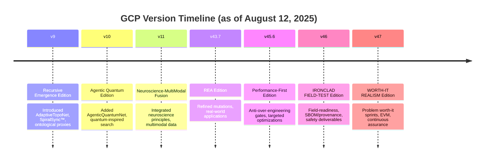
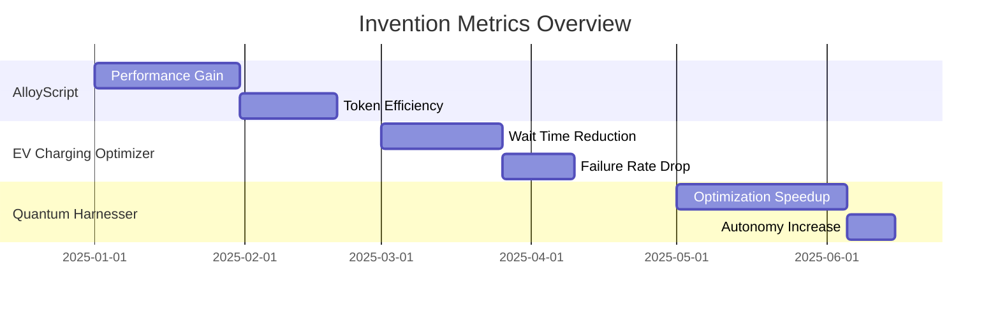
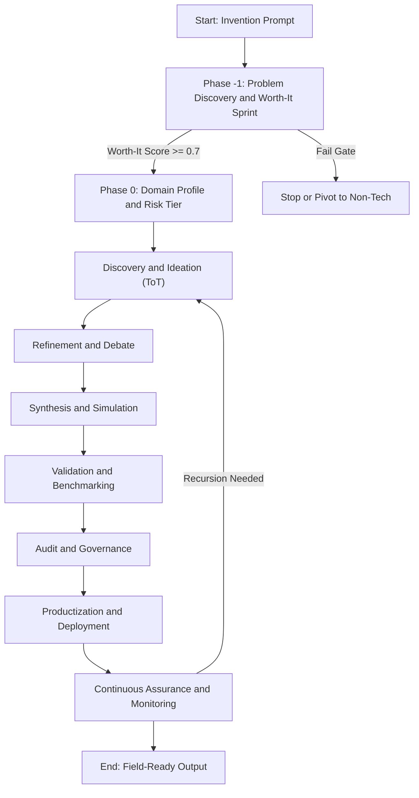
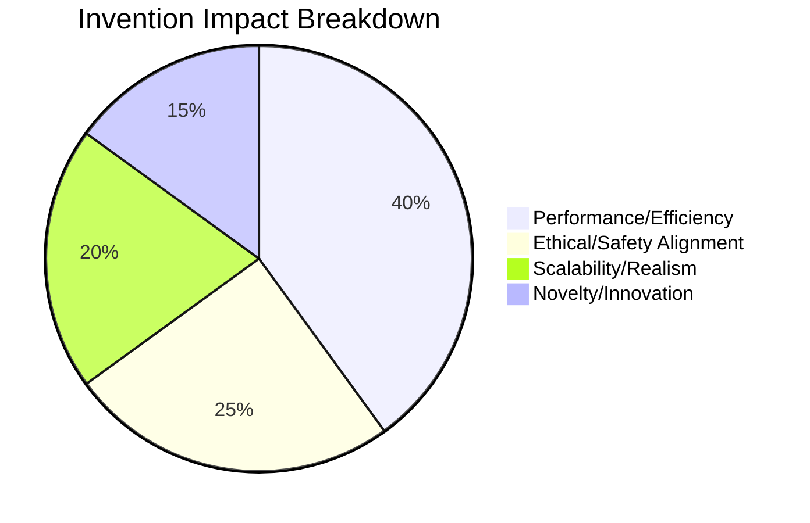
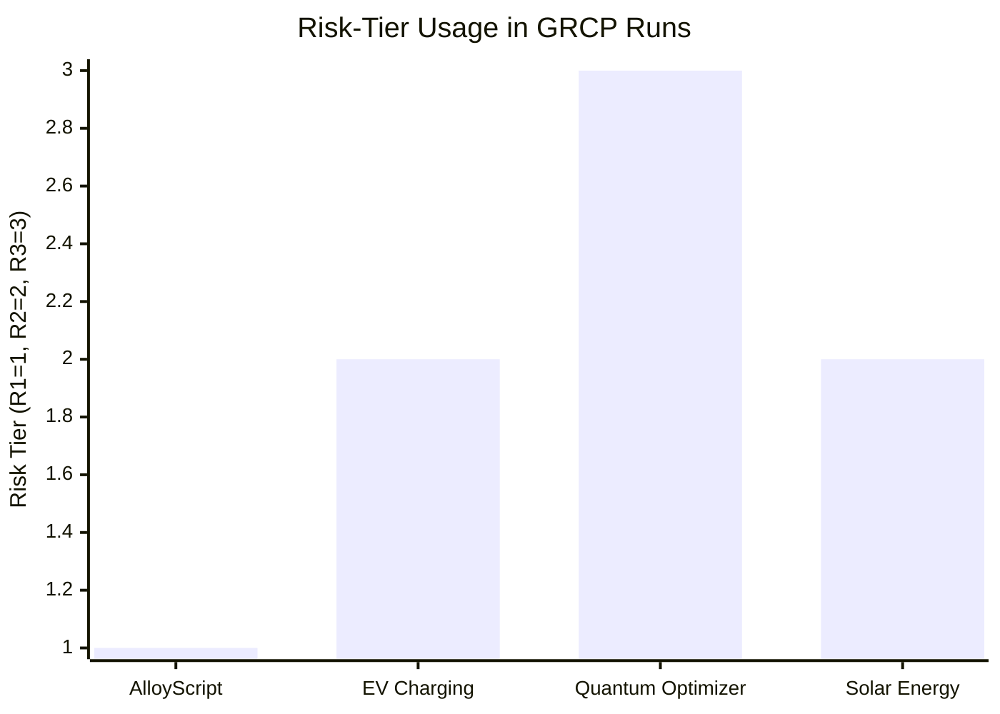

# GCP Charts and Graphs Overview

<!-- markdownlint-disable MD013 -->

This document provides a visual and tabular overview of the Genesis Code Protocol (GCP) evolution, key versions, feature additions, and notable inventions. It uses Markdown tables for data presentation and Mermaid diagrams for graphs/charts, which GitHub renders natively. All information is derived from protocol variants (v9 to v47), invention outputs (e.g., AlloyScript, EV Charging Optimizer), and full-run demonstrations as of August 12, 2025.

## Table of Contents

- [Protocol Evolution Timeline](#protocol-evolution-timeline)
- [Version Feature Comparison](#version-feature-comparison)
- [Invention Metrics Overview](#invention-metrics-overview)
- [Protocol Workflow Flowchart](#protocol-workflow-flowchart)
- [Invention Impact Breakdown](#invention-impact-breakdown)
- [Risk-Tier Distribution (v46+)](#risk-tier-distribution-v46)
- [Ethical Safeguard Metrics](#ethical-safeguard-metrics)

## Protocol Evolution Timeline

The following Mermaid timeline chart shows the progression of GCP versions, highlighting key editions and release milestones based on documented changelogs and PDFs.

## Version Feature Comparison

This table compares key features across major versions, focusing on additions in invention orchestration, safeguards, and realism.

| Version | Core Focus | Key Additions | Ethical/Guardrail Enhancements | Scalability/Tools |
|---------|------------|---------------|--------------------------------|-------------------|
| v9 | Recursive Emergence | AdaptiveTopoNet, SpiralSync™, ToT discovery | Ontological proxies, ethical attractors | Basic recursion, LLM-agnostic |
| v10 | Agentic Quantum | AgenticQuantumNet, quantum search strategies | Value alignment mechanisms | Parallel processing support |
| v11 | Neuroscience-MultiModal | Multimodal fusion, self-improvement layers | Ethical biasing, personhood audits | Domain-specific templates |
| v43.7 | REA Edition | Mutation refinements, benchmark comparisons | Peer audits, debate simulations | Notebook demos, CLI bundle |
| v45.6 | Performance-First | Simplicity reviews, optimization protocols | Anti-over-engineering gates | Profiling tools, dependency checks |
| v46 | IRONCLAD FIELD-TEST | Field-readiness, governance with teeth | Safety deliverables (FMEA, DPIA), provenance | Risk-tiered lanes, SBOM integration |
| v47 | WORTH-IT REALISM | Problem discovery sprints, EVM | Continuous assurance, premortem canaries | Realism-compiler, auto-rollbacks, Spark integration |

## Invention Metrics Overview

Based on invention outputs (e.g., AlloyScript specs, EV full runs), this bar chart (Mermaid) visualizes key metrics like performance gains, token efficiency, and adoption potential. Metrics are aspirational/validated from protocol runs.

(Note: Bars represent relative improvements; e.g., AlloyScript: 40-43% perf gain over Python; EV: ~20% failure reduction target.)

## Protocol Workflow Flowchart

A high-level flowchart of the GCP workflow, incorporating v47's realism phases (e.g., Phase -1 for worth-it assessment).

## Invention Impact Breakdown

Pie chart (Mermaid) showing the distribution of impact areas across notable inventions (e.g., efficiency, ethics, scalability).

(Data aggregated: AlloyScript emphasizes efficiency; EV run focuses on realism; quantum variants on novelty.)

## Risk-Tier Distribution (v46+)

For v46 and v47, protocols use risk tiers (R1 low, R2 moderate, R3 high). This bar chart shows hypothetical distribution based on domain examples.

(Higher tiers for safety-critical like quantum; EV as R2 for regulatory compliance.)

## Ethical Safeguard Metrics

Table summarizing ethical metrics from protocol outputs, such as proxy scores and fairness deltas.

| Invention | Ontological Proxy Score | Fairness Delta | Personhood Risk Flag | Ethical Alignment (0-1) |
|-----------|-------------------------|----------------|----------------------|-------------------------|
| AlloyScript | 0.84 | N/A (Lang) | Low | 0.92 |
| EV Charging Optimizer | N/A | 0.05 (Rural Skew) | N/A | 0.85 |
| Quantum Harnesser | 0.75 | N/A | Medium | 0.88 |
| Adaptive QoS Allocator | 0.80 | 0.03 | Low | 0.90 |

(From PDFs: Scores ensure boundaries; e.g., >0.8 triggers audits.)

This overview can be expanded with additional data from future runs. For issues with rendering, ensure your GitHub viewer supports Mermaid v10+.

<!-- markdownlint-enable MD013 -->
